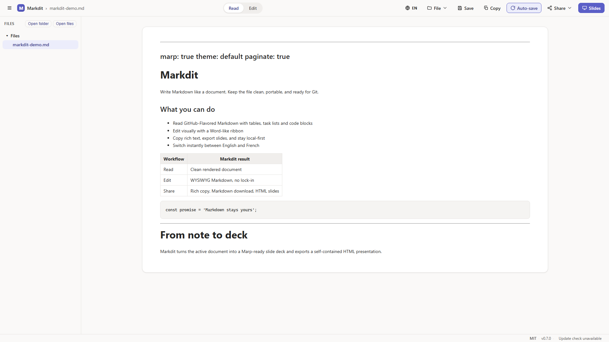
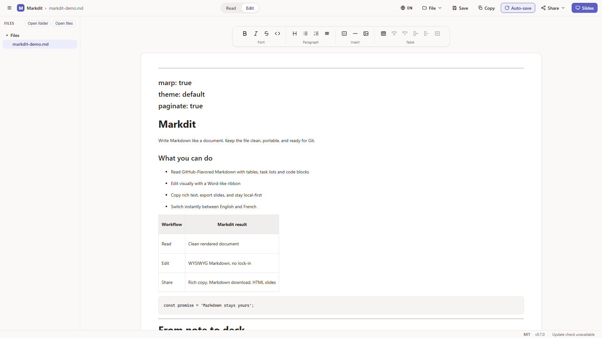
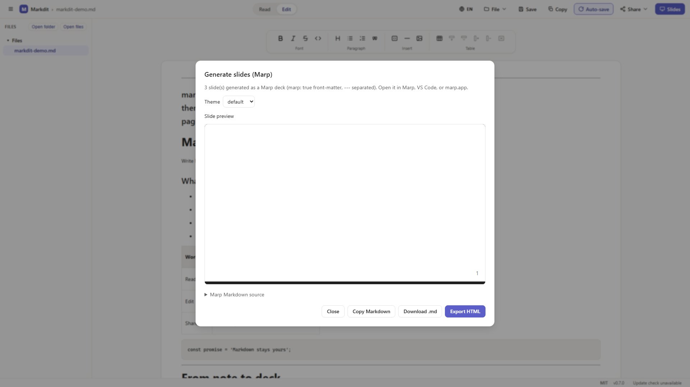

# Markdit

**Markdown should feel like a document, not a syntax exercise.** Markdit is a
Windows-first, local-first WYSIWYG Markdown editor for people who want the
portability of `.md` files with the comfort of a polished writing app.

Open a Markdown file, read it like GitHub would render it, switch to visual
editing when you need to write, then copy, share, or turn the same document into
slides. No proprietary format. No cloud account. No lock-in.

[**Download the latest release**](https://github.com/EtienneSIG/Markdit/releases/latest)

## Table of contents

- [See it in action](#see-it-in-action)
- [Why Markdit](#why-markdit)
- [Download](#download)
- [Core capabilities](#core-capabilities)
- [Architecture](#architecture)
- [Development](#development)
- [Spec-driven and compliance-aware](#spec-driven-and-compliance-aware)
- [License](#license)

## See it in action

### Read Markdown like a finished document



Markdit renders GitHub-Flavored Markdown cleanly: headings, tables, task lists,
code blocks, links, local images, and Mermaid diagrams are shown in a focused
document view with a file sidebar and bilingual UI.

### Edit visually, keep real Markdown



The Word-like ribbon gives writers familiar controls for formatting, lists,
quotes, code blocks, and tables. Under the hood, the file remains clean,
portable Markdown that still belongs in Git.

### Turn notes into slides



The active document can become a Marp slide deck with live preview, selectable
theme, Markdown copy/download, and self-contained HTML export - all on-device.

## Why Markdit

| Need | Markdit answer |
| --- | --- |
| Read `.md` files without raw syntax | GitHub-Flavored Markdown rendering with a clean document surface |
| Write without memorizing Markdown | WYSIWYG editor with a familiar formatting ribbon |
| Keep files portable | Markdown stays the source of truth; no proprietary project format |
| Share quickly | Copy as rich text, download Markdown, or export HTML slides |
| Work privately | Local-first defaults, remote content blocked by default, telemetry off until consent |
| Ship responsibly | Accessibility, privacy, security, SBOM, and compliance work tracked in the repo |

## Download

Get the newest Windows build from the
[**Releases** page](https://github.com/EtienneSIG/Markdit/releases/latest).

Choose the package that fits your workflow:

| Package | Best for |
| --- | --- |
| `Markdit_<version>_x64-setup.exe` | Recommended per-user installer, no admin rights required |
| `Markdit_<version>_x64_en-US.msi` | Standard Windows Installer deployment |
| `markdit.exe` | Portable executable, no installation |

Windows 11 already includes the required WebView2 runtime. On Windows 10, the
installer fetches it automatically when needed.

> First launch may show a Microsoft Defender SmartScreen warning because the
> installer is not signed with a paid certificate. Follow the illustrated
> [installation guide](docs/INSTALL.md) to install it safely.

## Core capabilities

1. **Reader mode** - open Markdown and get a polished, Git-compatible reading
   experience.
2. **Visual editing** - format content with a ribbon while Markdit preserves
   clean Markdown.
3. **File navigation** - open files or folders, browse Markdown documents, and
   collapse the sidebar for a wider writing surface.
4. **Rich copy and sharing** - copy rendered content with Markdown fallback,
   download the current file, or prepare an email handoff.
5. **Slide generation** - create Marp-compatible decks from the current
   document and export self-contained HTML.
6. **Bilingual UI** - switch between English and French from the top bar.
7. **Privacy-first defaults** - local files stay local; telemetry and remote
   content require explicit consent.

## Architecture

Markdit is a Tauri 2 desktop app. The Markdown engine is the single source of
truth in the TypeScript frontend; the Rust core focuses on local file I/O,
settings persistence, signed updates, and file watching.

| Area | Responsibility |
| --- | --- |
| `src-tauri/` | Native desktop shell, file open/save, settings, updates, file watching |
| `src/markdown/` | CommonMark/GFM parsing, serialization, sanitised rendering, syntax highlighting |
| `src/components/` | Reader, TipTap WYSIWYG editor, toolbar, sidebar, status bar |
| `src/slides/` | Marp deck generation, preview, Markdown/HTML export |
| `src/privacy/` | Consent state, opt-in telemetry, privacy controls |

## Development

Prerequisites: Node 20+ and, for the desktop build, the Rust toolchain with the
Tauri prerequisites.

```powershell
npm install
npm run test
npm run lint
npm run dev
npm run tauri dev
npm run build
npm run sbom
```

End-to-end and accessibility suites use Playwright and axe-core:

```powershell
npm run test:e2e
npm run test:a11y
```

To refresh the golden round-trip corpus after an intentional Markdown engine
change:

```powershell
node scripts/generate-corpus.mjs
```

## Spec-driven and compliance-aware

Markdit uses [GitHub Spec Kit](https://github.com/github/spec-kit) for
spec-driven development. Key project artifacts:

| Artifact | Link |
| --- | --- |
| Constitution | [.specify/memory/constitution.md](.specify/memory/constitution.md) |
| Core feature spec | [specs/001-markdit-core/spec.md](specs/001-markdit-core/spec.md) |
| Compliance agents | [.github/agents/](.github/agents) |
| Compliance backlog | [compliance/backlog/README.md](compliance/backlog/README.md) |

The project tracks GDPR, European Accessibility Act / EN 301 549, Cyber
Resilience Act, CCPA/CPRA, ADA / Section 508, PIPEDA, and related requirements.
See [SECURITY.md](SECURITY.md) for the security model, signing, SBOM, and
vulnerability disclosure process.

## License

Markdit is released under the [MIT License](LICENSE) © 2026 Etienne Sigwald.
