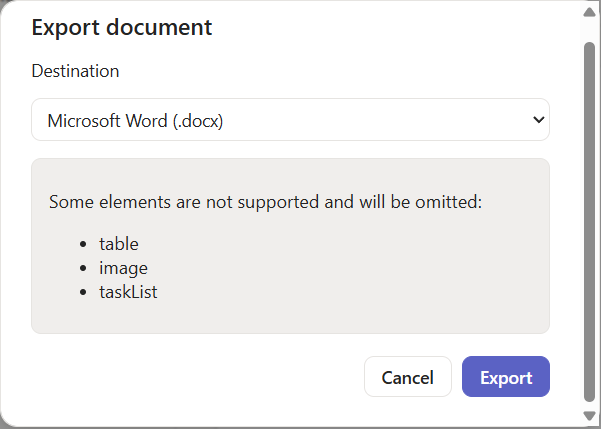

# Markdit

Markdit is a Windows-first **WYSIWYG Markdown editor** that lets you read, edit,
and export Markdown documents without writing Markdown syntax by hand. The look
and feel takes cues from Microsoft Loop, with a Word-like formatting ribbon.

## Screenshots

**Read mode** — open `.md` files and read them rendered with GitHub-Flavored
Markdown fidelity, in a clean document card with a collapsible file sidebar.


**Edit mode** — a Word-like formatting ribbon (Font, Paragraph, Insert) drives a
WYSIWYG editor while the underlying file stays portable, clean Markdown.


**Export** — export to Microsoft Word (`.docx`) offline, or to OneNote/Loop with
explicit consent. Unsupported elements are listed up front before anything is
written or leaves the device.



## Capabilities

1. **Read Markdown like on Git** — open `.md` files and see them rendered with
   GitHub-Flavored Markdown fidelity (tables, task lists, fenced code, etc.).
2. **Visual editing without Markdown** — Word-like formatting ribbon and styles;
   the underlying file stays clean, portable Markdown.
3. **Collapsible navigation** — a burger toggle shows/hides the file sidebar so
   the document can use the full width.
4. **Installable on Windows** — signed installer with clean updates/uninstall.
5. **Export** — to Microsoft Word (`.docx`, fully offline) and, with explicit
   consent, OneNote and Loop via Microsoft Graph.

## Regulatory compliance

Markdit targets EU and North American markets and is held to GDPR, the European
Accessibility Act / EN 301 549, the Cyber Resilience Act, CCPA/CPRA, ADA /
Section 508, PIPEDA, and related requirements. Dedicated compliance agents audit
the project **a posteriori** and maintain a remediation backlog. See
[compliance/backlog/README.md](compliance/backlog/README.md).

## Development with Spec Kit

This project uses [GitHub Spec Kit](https://github.com/github/spec-kit) for
Spec-Driven Development. Use the slash commands in GitHub Copilot Chat:

| Command | Purpose |
| --- | --- |
| `/speckit.constitution` | Project governing principles (`.specify/memory/constitution.md`) |
| `/speckit.specify` | Define what to build |
| `/speckit.clarify` | De-risk ambiguous requirements |
| `/speckit.plan` | Technical implementation plan |
| `/speckit.tasks` | Generate actionable tasks |
| `/speckit.analyze` | Cross-artifact consistency check |
| `/speckit.implement` | Execute the plan |
| `/markdit.compliance.eu` | EU regulatory audit → compliance backlog |
| `/markdit.compliance.na` | North American regulatory audit → compliance backlog |
| `/markdit.compliance.audit` | Run both audits, consolidate, and give a release verdict |

### Key artifacts

- Constitution: [.specify/memory/constitution.md](.specify/memory/constitution.md)
- Core feature spec: [specs/001-markdit-core/spec.md](specs/001-markdit-core/spec.md)
- Compliance agents: [.github/agents/](.github/agents)

## Architecture

Markdit is a Tauri 2 desktop app. The **Markdown engine is the single source of
truth** and lives entirely in the TypeScript frontend; the Rust core handles only
local file I/O, settings persistence, signed updates, and file watching.

- **Rust core** (`src-tauri/`): file open/save with content-hash conflict
  detection, privacy-first settings store, offline `.docx` write, updater.
- **Frontend** (`src/`):
  - `markdown/` — `unified` + `remark` (CommonMark + GFM) parse/serialize,
    `rehype-sanitize` rendering, Shiki highlighting, and the TipTap ⇄ mdast
    bridge. This is the constitutional heart and is covered by the round-trip
    corpus and unit tests.
  - `components/` — reader, TipTap WYSIWYG editor, accessible toolbar, source view.
  - `export/` — offline Word (`docx`) and consented OneNote/Loop via Microsoft
    Graph + MSAL.
  - `privacy/` — consent state machine, opt-in telemetry, data-subject rights.

## Development

Prerequisites: Node 20+ and (for the desktop build) the Rust toolchain + Tauri
prerequisites.

```powershell
npm install            # install frontend dependencies
npm run test           # Vitest unit + golden-file round-trip corpus
npm run lint           # ESLint
npm run dev            # Vite dev server (web surface)
npm run tauri dev      # full desktop app (requires Rust/Tauri toolchain)
npm run build          # production frontend build
npm run sbom           # generate a CycloneDX SBOM (sbom/markdit-sbom.json)
```

End-to-end and accessibility suites use Playwright + axe-core
(`npm run test:e2e`, `npm run test:a11y`).

To refresh the golden round-trip corpus after an intentional engine change:

```powershell
node scripts/generate-corpus.mjs
```

### Build a Windows executable

The desktop build requires the Rust toolchain and the Tauri prerequisites
(Microsoft C++ Build Tools and the WebView2 runtime, which ships with Windows
11). To produce the app and its Windows installers:

```powershell
npm run tauri build
```

The build outputs land under `src-tauri/target/release/`:

- `markdit.exe` — the standalone application executable.
- `bundle/msi/Markdit_<version>_x64_en-US.msi` — Windows Installer package.
- `bundle/nsis/Markdit_<version>_x64-setup.exe` — NSIS setup (per-user install).

> Installer code-signing is optional for local builds; see
> [SECURITY.md](SECURITY.md) for the production signing and update model.

### Cloud export setup (OneNote / Loop)

Exporting to Word works fully offline with no configuration. Exporting to
**OneNote or Loop** uses Microsoft Graph and therefore requires a free Microsoft
Entra ID (Azure AD) application registration: copy your application (client) id
into a local `.env.local` file as `VITE_MSAL_CLIENT_ID`. Step-by-step
instructions are in [.env.example](.env.example). Without it, Markdit shows a
clear message instead of attempting sign-in.


Markdit is **local-first**. On first run telemetry is off, remote content is
blocked, and no cloud consents exist. Nothing leaves the device without an
explicit, recorded consent. The UI targets **WCAG 2.2 AA** (keyboard-navigable,
visible focus, high-contrast theme). See [SECURITY.md](SECURITY.md) for the
security model, signing, SBOM, and vulnerability disclosure process.

