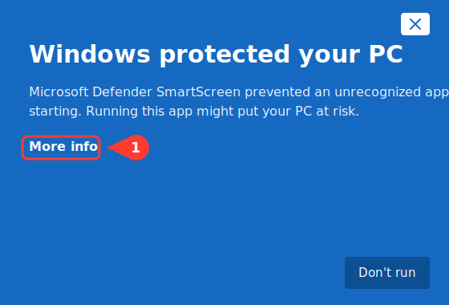
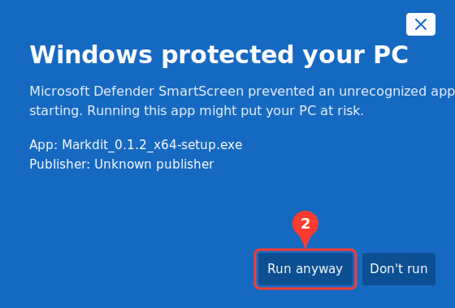
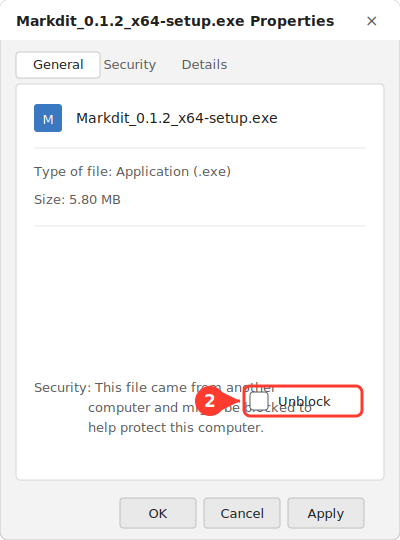

# Installer Markdit sur Windows

Markdit est distribué **sans certificat de signature de code payant**. Au premier
lancement, Windows (Microsoft Defender **SmartScreen**) peut donc afficher un
avertissement « éditeur inconnu ». L'application n'est pas dangereuse : ce message
apparaît pour **toute** application non signée. Voici comment l'installer en toute
sérénité.

> 💡 Vérifie toujours que tu as téléchargé l'installeur depuis la page officielle
> des _releases_ : https://github.com/EtienneSIG/Markdit/releases

---

## Méthode A — « Exécuter quand même » (la plus simple)

### Étape 1 — Cliquer sur « More info »

Lance l'installeur (`Markdit_x.y.z_x64-setup.exe` ou le `.msi`). Dans la fenêtre
bleue SmartScreen, clique sur le lien **More info** (Informations complémentaires).



### Étape 2 — Cliquer sur « Run anyway »

Le détail de l'application s'affiche (`Publisher: Unknown publisher`). Clique sur
le bouton **Run anyway** (Exécuter quand même) qui vient d'apparaître.



L'installation démarre normalement. ✅

---

## Méthode B — « Débloquer » le fichier avant de l'ouvrir

Tu peux aussi retirer le marquage « fichier téléchargé d'Internet » avant même de
lancer l'installeur.

### Étape 1 — Ouvrir les propriétés du fichier

Dans l'Explorateur de fichiers, **clic droit** sur l'installeur téléchargé →
**Properties** (Propriétés).

### Étape 2 — Cocher « Unblock » puis valider

En bas de l'onglet **General**, coche la case **Unblock** (Débloquer), puis clique
sur **OK**. Double-clique ensuite sur l'installeur : plus aucun avertissement.



---

## Pourquoi cet avertissement ?

| | |
|---|---|
| **Cause** | L'installeur n'est pas signé avec un certificat de signature de code reconnu, et n'a pas encore de « réputation » SmartScreen. |
| **Risque réel** | Aucun lié à la signature : le message est purement informatif pour les apps non signées. |
| **Suppression définitive** | Nécessite un certificat **EV** (immédiat) ou **OV** (réputation à construire), ou **Azure Trusted Signing**. Tous payants. |

---

## Pour les développeurs — signer la build localement

Si tu compiles Markdit toi-même, tu peux supprimer l'avertissement **sur tes
propres machines** avec un certificat auto-signé :

```powershell
npm run tauri build
pwsh -File scripts/sign-windows.ps1 -CreateSelfSigned
```

Le script crée un certificat auto-signé, l'ajoute à tes magasins de confiance
_par utilisateur_ (sans droits administrateur, réversible via `certmgr.msc`) et
signe `markdit.exe` + les installeurs MSI/NSIS.

> ⚠️ Une signature auto-signée ne supprime l'avertissement **que** sur les
> machines qui font confiance à ce certificat. Pour une distribution publique,
> utilise un vrai certificat : `pwsh -File scripts/sign-windows.ps1 -Thumbprint <empreinte>`.

> ℹ️ Les illustrations de ce guide sont des **maquettes** des fenêtres Windows
> (libellés en anglais, comme l'interface SmartScreen) — pas des captures réelles.
