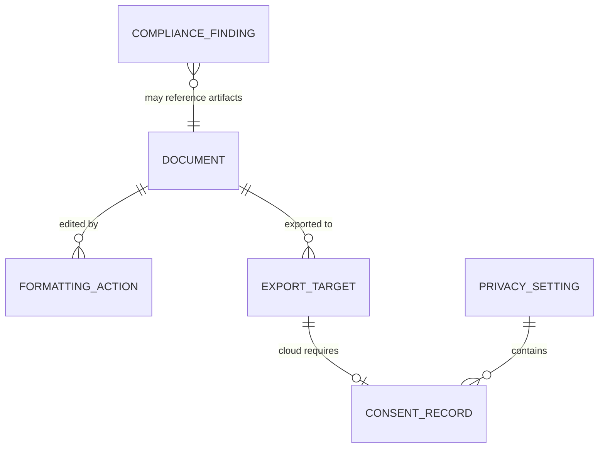

# Phase 1 Data Model: Markdit Core Editor

**Feature**: 001-markdit-core | **Date**: 2026-06-12

Markdit is local-first with no database. "Entities" below are in-memory and
on-disk shapes (plain `.md` documents + a local settings file), not relational
tables. Field types use TypeScript-style notation for the frontend boundary; the
Rust core mirrors the document/settings shapes for file I/O.

---

## 1. Document

The Markdown file the user reads/edits. **Source of truth is plain Markdown text.**

| Field | Type | Notes |
|-------|------|-------|
| `id` | `string` (UUID) | In-memory session id; not persisted to disk. |
| `filePath` | `string \| null` | Absolute path; `null` for an unsaved new doc. |
| `fileName` | `string` | Derived from `filePath`. |
| `encoding` | `'utf-8'` | UTF-8 only for MVP. |
| `markdown` | `string` | Canonical content — the persisted bytes. Single source of truth. |
| `mdast` | `Root` (mdast) | Parsed AST (transient, derived from `markdown`). |
| `dirty` | `boolean` | Unsaved-changes flag. |
| `lastSavedHash` | `string` | Hash of last-saved content for conflict detection. |
| `diskHash` | `string` | Hash observed on disk by the watcher (conflict detection). |
| `sizeBytes` | `number` | Used for the > 10 MB graceful-degradation threshold. |
| `state` | `DocumentState` | See state machine below. |

**Validation rules**
- `markdown` MUST parse under CommonMark + GFM; malformed input renders
  best-effort and never crashes (Edge Case: malformed file).
- Saving MUST be lossless: `parse(markdown)` → edit → `serialize` MUST not alter
  meaningful content (FR-005, SC-003).
- `sizeBytes > 10 MB` triggers documented degraded-performance mode, not failure.

**State transitions (`DocumentState`)**

```text
            open()                       edit()
  (none) ─────────────▶ Clean ───────────────────▶ Dirty
                          ▲                            │
                          │            save()          │
                          └────────────────────────────┘
                          
  Dirty ──external change detected──▶ ConflictPending ──user resolves──▶ Clean | Dirty
  any  ──close() with Dirty──▶ prompt (save / discard / cancel)
```

- `Clean`: in-memory matches `lastSavedHash`.
- `Dirty`: unsaved edits exist.
- `ConflictPending`: `diskHash != lastSavedHash` while editing — user is prompted;
  no overwrite without confirmation (Edge Case: save conflict).

---

## 2. Formatting Action

A visual editing command mapped deterministically to a standard Markdown construct.
Used by the toolbar and keyboard shortcuts; carries no persisted state.

| Field | Type | Notes |
|-------|------|-------|
| `id` | `FormattingActionId` | e.g. `bold`, `italic`, `heading`, `bulletList`, `orderedList`, `taskList`, `link`, `table`, `codeBlock`, `blockquote`, `strikethrough`, `inlineCode`, `horizontalRule`. |
| `label` | `string` | Accessible, localizable label. |
| `shortcut` | `string \| null` | Keyboard shortcut (e.g. `Mod-b`). |
| `markdownMapping` | `string` | The standard Markdown construct produced (documented mapping). |
| `isActive(selection)` | `boolean` | Toolbar toggle state for current selection. |
| `isAvailable(selection)` | `boolean` | Whether the action applies in context. |
| `isPortable` | `boolean` | `false` for constructs not representable in portable Markdown (isolated/reversible per Principle II). |

**Validation rules**
- Every action with `isPortable = true` MUST serialize to standard CommonMark/GFM.
- Actions MUST be operable by keyboard and exposed to assistive tech (FR-013).

---

## 3. Export Target

A destination format/service with capabilities and limitations.

| Field | Type | Notes |
|-------|------|-------|
| `id` | `'word' \| 'onenote' \| 'loop'` | Target identifier. |
| `displayName` | `string` | UI label. |
| `mode` | `'offline' \| 'cloud'` | `word`=offline; `onenote`/`loop`=cloud. |
| `requiresAuth` | `boolean` | `true` for cloud targets (MSAL sign-in). |
| `requiredScopes` | `string[]` | Least-privilege Graph scopes (cloud only). |
| `supportedElements` | `MarkdownElement[]` | Elements representable in the target. |
| `unsupportedElements` | `MarkdownElement[]` | Reported to the user before/after export. |

**Validation rules**
- Cloud targets MUST NOT transmit content without explicit consent (FR-011).
- Unrepresentable elements MUST be reported; no silent data loss (FR-010, SC-006).
- Export structure fidelity target ≥ 95% of supported elements (SC-006).

**ExportResult**

| Field | Type | Notes |
|-------|------|-------|
| `target` | `ExportTarget['id']` | |
| `status` | `'success' \| 'partial' \| 'cancelled' \| 'failed'` | |
| `outputLocation` | `string \| null` | File path (Word) or service URL (cloud). |
| `droppedElements` | `MarkdownElement[]` | Non-representable elements omitted. |
| `message` | `string` | User-facing summary. |

---

## 4. Privacy / Consent Setting

User-controlled preferences governing telemetry, remote content, and cloud export.
Persisted in a local settings file (not document content).

| Field | Type | Default | Notes |
|-------|------|---------|-------|
| `telemetryEnabled` | `boolean` | `false` | Opt-in, anonymized, disableable (FR-014). |
| `allowRemoteContent` | `boolean` | `false` | Gates fetching remote images/links (FR-003). |
| `cloudExportConsents` | `Record<'onenote' \| 'loop', ConsentRecord>` | empty | Per-target consent. |
| `signedInAccount` | `AccountInfo \| null` | `null` | MSAL account; cleared on sign-out. |
| `locale` | `string` | OS default | UI language. |
| `theme` | `'system' \| 'light' \| 'dark' \| 'high-contrast'` | `system` | Respects OS a11y settings. |

**ConsentRecord**

| Field | Type | Notes |
|-------|------|-------|
| `granted` | `boolean` | |
| `grantedAt` | `string (ISO 8601) \| null` | Audit trail for SC-008. |
| `scopes` | `string[]` | Scopes consented to. |

**Validation rules**
- Default state MUST keep everything local (`telemetryEnabled=false`,
  `allowRemoteContent=false`, no consents) — Principle III.
- Data-subject rights: settings MUST support export and deletion of personal data
  (FR-012). Revoking a consent MUST invalidate the related `signedInAccount` token
  cache where applicable.

---

## 5. Compliance Finding

An audit result emitted a posteriori by compliance agents, stored in the backlog
(`compliance/backlog/`). Not produced by the editor at runtime; modeled here for
traceability (FR-016, Principle VI).

| Field | Type | Notes |
|-------|------|-------|
| `id` | `string` | Stable finding id. |
| `regulation` | `string` | e.g. `GDPR`, `EN 301 549`, `CRA`, `CCPA/CPRA`, `Section 508`. |
| `clause` | `string` | Specific article/clause referenced. |
| `severity` | `'CRITICAL' \| 'HIGH' \| 'MEDIUM' \| 'LOW'` | No open `CRITICAL` at release (SC-009). |
| `affectedArtifact` | `string` | spec/plan/task/source reference. |
| `summary` | `string` | What was found. |
| `proposedRemediation` | `string` | Suggested fix. |
| `status` | `'open' \| 'in-progress' \| 'resolved' \| 'accepted-risk'` | |

**Validation rules**
- Every finding MUST cite a `regulation` + `clause` and a `severity` (SC-009).
- Release gate: zero `status=open` with `severity=CRITICAL`.

---

## Relationships



- A `Document` is acted on by many `Formatting Action`s and can be sent to many
  `Export Target`s.
- Cloud `Export Target`s require a `ConsentRecord` held in `Privacy Setting`.
- `Compliance Finding`s reference artifacts (specs/plan/source) a posteriori.
